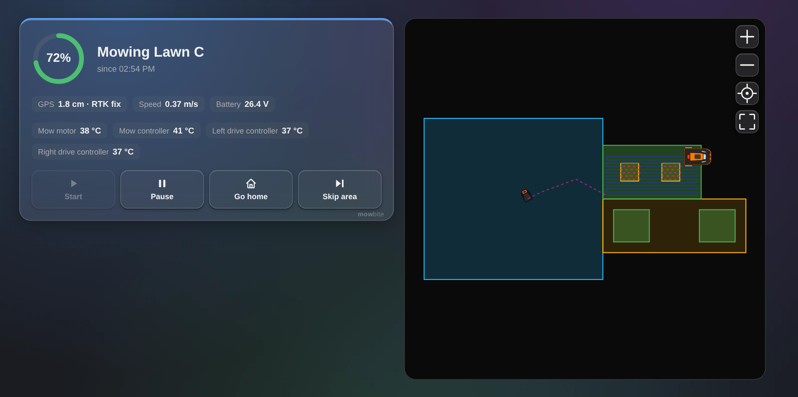
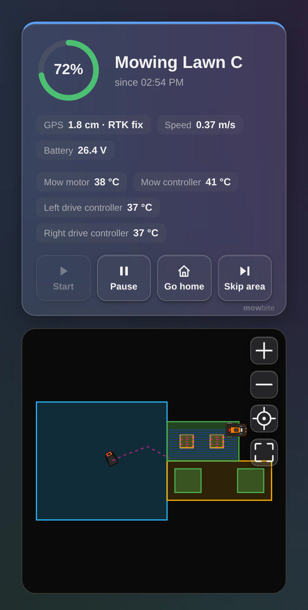

# MowBite for OpenMower

A Home Assistant integration that brings an [OpenMower](https://github.com/ClemensElflein/OpenMower) robot mower
into Home Assistant, with the map and the look of [MowBite](https://github.com/mkaaaaaay/mowbite). It talks to the
mower's MQTT broker directly, no cloud and no extra add-on.

MowBite is a community project and not affiliated with the OpenMower project.



## What it does

- **The mower in Home Assistant**: a lawn mower entity with start, pause and go home, so Home Assistant's own
  mower controls work with it. Start goes on where a paused mow stopped.
- **Sensors**: battery, state, GPS quality and accuracy, battery voltage, mow motor temperature, and more that
  are off by default (charge voltage and current, motor controller temperatures, mow motor current and speed).
  Emergency stop, charging and rain as binary sensors.
- **Buttons** for skipping an area and for resetting an emergency stop. The reset is off by default, an
  emergency stop has a reason out at the mower.
- **Events** for automations and notifications: all areas done, heading home (with the reason: battery, rain,
  mow motor too hot or sent home), docked, left the dock, docking retry, docking or undocking failed,
  navigation error, mow motor didn't start, GPS lost while mowing, emergency stop and cleared, fully charged,
  job dropped, mower started, shut down. Each comes with a message in Home Assistant's language.
- **Push notifications** with the blueprint below: pick your phone and the events, every message has buttons to
  snooze for an hour or until the next morning. A switch pauses them as long as you like.
- **The MowBite card**: the mower like on MowBite's dashboard, its status, the buttons and the map with the
  areas, obstacles, the docking station, the mower and its track. On wide screens side by side, on phones one
  below the other. It comes with the integration, no resource to add.
- **Map colours and icons from MowBite**: with the address of your MowBite container set, the map uses the
  colours, icons and icon sizes you picked in the app.
- **The mower at its real size**: with the mower's sizes known the map draws its outline with the blade, and along
  the track the strip the blade really cut.



What it reads is what OpenMower publishes on MQTT: `robot_state`, `actions`, `sensors`, `events`,
`position` and `map`. The track of a job that was already running when Home Assistant started comes from the
mower's position history (OpenMower 1.3 and newer). An emergency stop is told once it has lasted 10 seconds,
like MowBite's own notifications do it, and a navigation error only when the mower doesn't head home right
after it (OpenMower reports one when it's sent home in the middle of a path).

## Install

You need Home Assistant 2026.9 or newer and the MQTT broker on your mower reachable from Home Assistant
(port 1883).

**With HACS**: three dots top right, Custom repositories, add `https://github.com/mkaaaaaay/mowbite-ha` with
the type Integration. Then search for MowBite for OpenMower in HACS, download it and restart Home Assistant.

**By hand**: copy `custom_components/mowbite` into the `custom_components` folder of your Home Assistant
configuration and restart.

## Set up

Settings, Devices & services, Add integration, MowBite for OpenMower:

- **Broker host**: usually the mower itself, `openmower` or its IP address. **Port** 1883.
- **Topic prefix**: empty on the mower's own broker. Only if your OpenMower publishes behind a prefix, for
  example `openmower/` when it's bridged to another broker.
- **Username and password**: only if your broker has a login.

It checks that a mower answers before it saves. Several mowers work too, each is its own entry.

Under **Configure** on the integration:

- **MowBite address**: where your MowBite container runs, for example `http://openmower:8080`. Optional, the
  map uses MowBite's default colours and icons without it.
- **Show the map**: when the cards show the map, as set in the MowBite app, only while the mower drives, always
  or never. A card can still have its own setting.
- **Mower sizes**: for the mower's outline and the strip its blade cuts on the map. Pick your mower, or Own sizes
  for a form like the one in the MowBite app (in cm, from the middle between the rear drive wheels). Sizes set in
  the MowBite app come first.

## The card

Edit a dashboard, add a card and search for MowBite for OpenMower. In YAML:

```yaml
type: custom:mowbite-card
entity: lawn_mower.openmower
map: integration   # integration, app, auto (while it drives), always or never
map_height: 260    # pixels, leave it out for a square map like in the app
status: true       # false shows only the map
theme: frost       # frost (frosted glass), dark, light or auto (like Home Assistant)
blur: true         # false is lighter for older tablets
```

The map zooms with the buttons, the mouse wheel or two fingers, and moves when dragged. While the mower drives the
map follows it like the app's overview: a few metres around the mower, with the mower gliding in the middle.
Zooming changes how much is shown around it, dragging the map stops following, the target button starts it
again.

## Notifications

Settings, Automations & scenes, Blueprints, Import blueprint:

```
https://github.com/mkaaaaaay/mowbite-ha/blob/main/blueprints/automation/mowbite/notify.yaml
```

Make an automation from it, pick the mower's events entity, your phone (with the Home Assistant app) and the
events you want to hear about. Errors come through as time-sensitive on iOS and with high priority on
Android.

## Troubleshooting

- **The card says "configuration error" right after installing**: reload the page once. The browser still has
  the page from before the integration was there.
- **Dashboards in YAML mode**: add `/mowbite/mowbite-card.js` as a JavaScript module resource yourself, the
  integration only adds it to dashboards Home Assistant keeps.
- **The mower is unavailable**: check the broker host and port, and the prefix. The integration keeps trying,
  a mower that's off (winter, shed) isn't an error.

## Development

The tests run against Home Assistant's own test tools:

```
pip install -r requirements_test.txt
pytest
```

## License

GPL-3.0, like MowBite.
